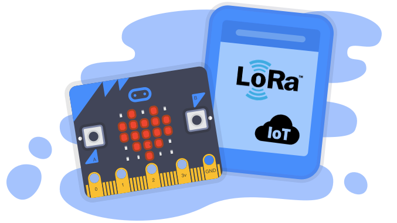

# Taller de Internet de las cosas y LoRa para principiantes. Construye tu sensor
La tecnología cada vez es más fácil de usar. Hasta hace poco, la construcción de un sensor típico de temperatura, su programación y la configuración de su conectividad era una tarea complicada. Pero ya existen tecnologías fiables y probadas; muy fáciles de usar como Micro:bit, Scratch y The Thing Networks.

## En este taller vamos a
* Saber qué son y para qué sirven las comunicaciones LoRaWAN. 
* Montar un multisensor para que nos envíe a nuestro móvil datos de movimiento, temperatura, luz y posición desde casi cualquier parte del mundo y sin coste.
* Aprender a programar en Scratch
* Aprender a configurar un nodo en The Things Networks
* Aprender a enviar alertas a tu móvil

## Necesitarás
Si quieres participar plenamente en este taller y llevarte tu sensor funcionando. Te sugerimos que compres las siguientes placas con anticipación. Aquí tienes los sitios más baratos que hemos encontrado:
* **IOT Micro**: [Bit Lora nodo (frecuencia EU 868 - 870 MHz)](https://ebay.us/Abt9Uj)
* **BBC micro:bit** [bulk micro-controller with motion detection, compass, LED display and Bluetooth](https://a.aliexpress.com/_d6tASCS)
* Cable micro-USB de datos.

## 1º Conectamos todo

La única aplicación que necesitaremos en el ordenador es un navegador de internet. Recomiendo Chrome. 
Abrimos el buscador Google para encontrar la aplicación web: Makecode Microbit (La dirección actual es (https://makecode.microbit.org/)[https://makecode.microbit.org/]

Una vez dentro de la aplicación podremos cambiar el idioma Desde el icono de configuración situado arriba a la derecha.

En esta pantalla principal seleccionaremos *Nuevo Proyecto*. Ahora es el momento de conectar todo incluyendo el cable USB con tu PC. Si al momento de la enchufarlo, se te muestra algún mensaje de instalar o actualizar controladores (drives) acepta y continúa hasta completar la instalación. 

Ahora es el momento de activar el dispositivo. De nuevo desde en icono de configuración, selecciona la opción de emparejar dispositivo (Pair Device). Aparecerá una ventana con la misma opción de nuevo.
Y con esto tú MicroBit ya estará preparada para programarse.

## Ejercicio 1: "Hola mundo" 

## Ejercicio 2: Sensor de movimiento
Conectando nuestro Micro:bit
Install Scratch Link
1
Download and install Scratch Link.

or
Direct download
2
Start Scratch Link and make sure it is running. It should appear in your toolbar.
