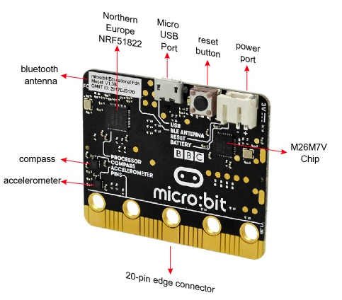
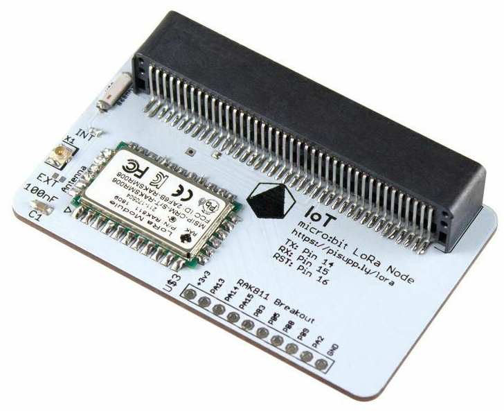
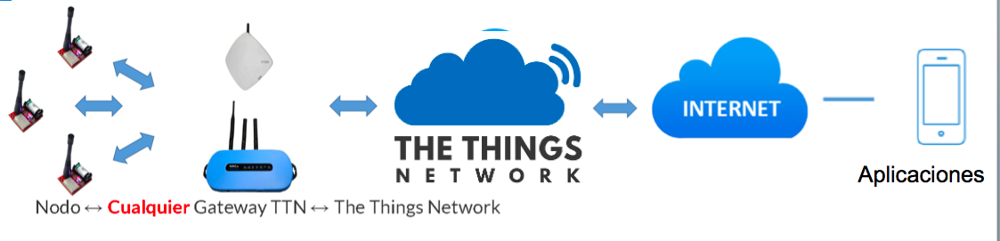
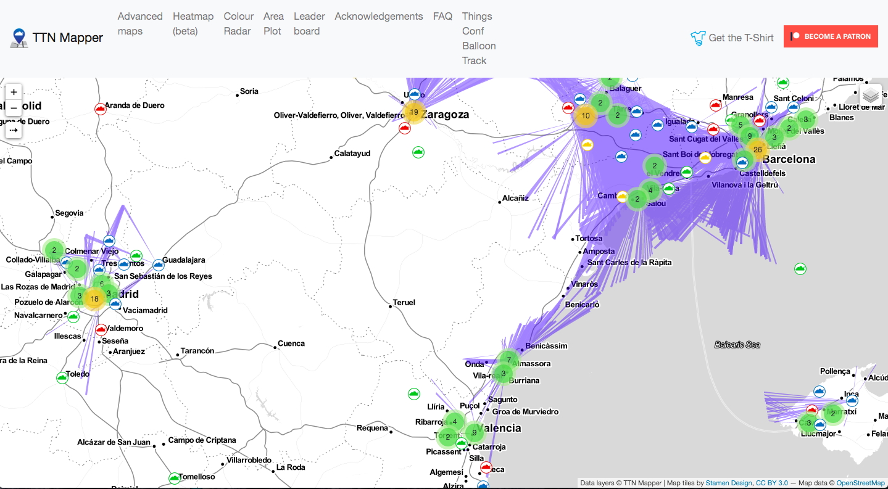
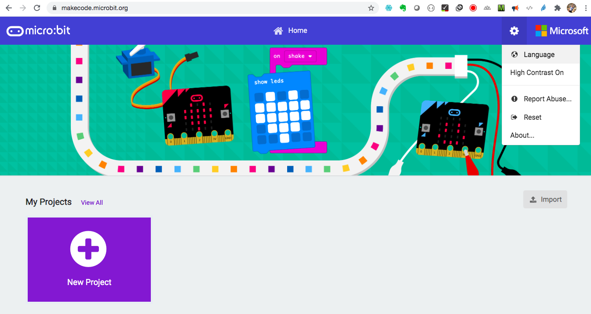
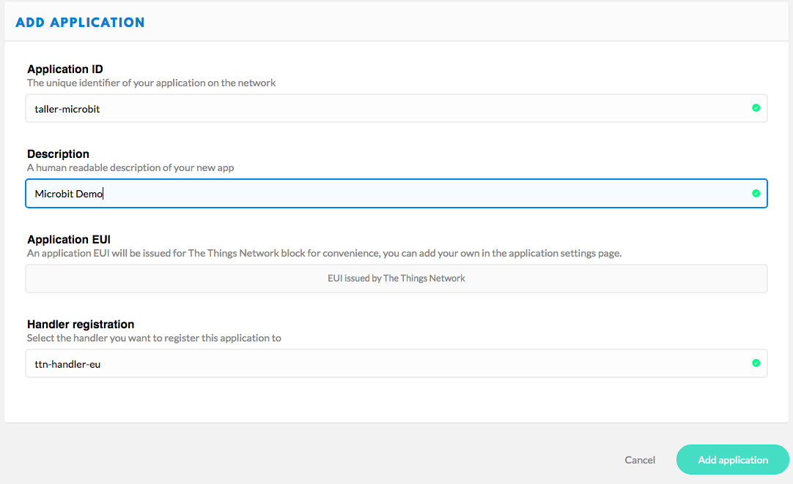
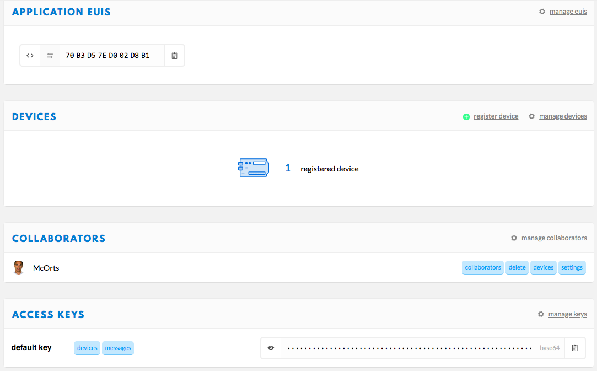
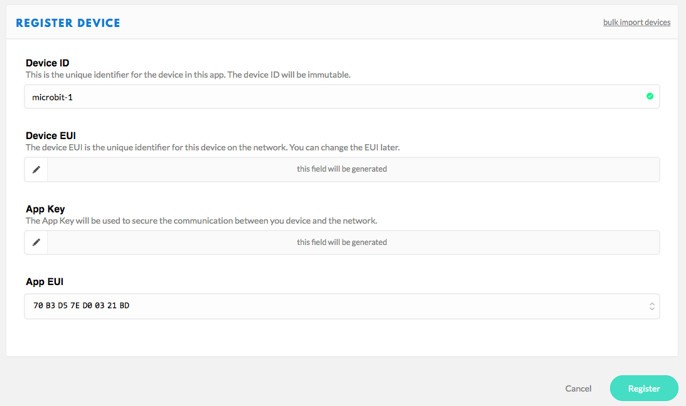
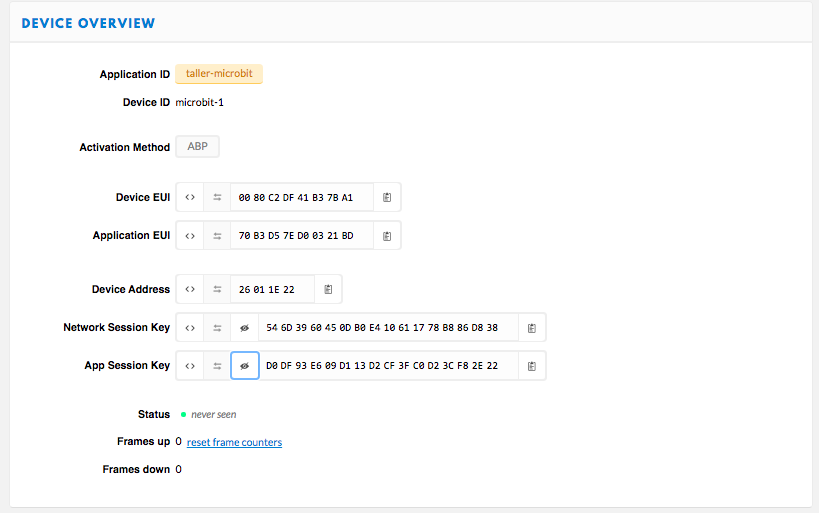
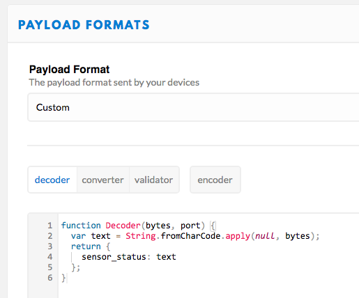

# Taller de Internet de las cosas y LoRa para principiantes. Construye tu sensor
La tecnología cada vez es más fácil de usar. Hasta hace poco, la construcción de un sensor típico de temperatura, su programación y la configuración de su conectividad era una tarea complicada. Pero ya existen tecnologías fiables y probadas; muy fáciles de usar como Micro:bit, Scratch y The Thing Networks.


## En este taller vamos a
* Saber qué son y para qué sirven las comunicaciones LoRaWAN. 
* Montar un multisensor para que nos envíe a nuestro móvil datos de movimiento, temperatura, luz y posición desde casi cualquier parte del mundo y sin coste.
* Aprender a programar en Scratch
* Aprender a configurar un nodo en The Things Networks
* Aprender a enviar alertas a tu móvil

## Necesitarás
Si quieres participar plenamente en este taller y llevarte tu sensor funcionando. Te sugerimos que compres las siguientes placas con anticipación. Aquí tienes los sitios más baratos que hemos encontrado:


* **BBC micro:bit** [bulk micro-controller with motion detection, compass, LED display and Bluetooth](https://a.aliexpress.com/_d6tASCS)


* **IOT Micro**: [Bit Lora nodo (frecuencia EU 868 - 870 MHz)](https://ebay.us/Abt9Uj)
* **Cable micro-USB** de datos.

## ¿Que es LoRaWAN y para que sirve?

Estamos hablando de un tipo de comunicación inalámbrica que permite transmitir datos a muy larga distancia y con bajo consumo de energía (~100mW). Es ideal para pequeños dispositivos que solo necesitan enviar información discreta como un dato de temperatura o una posición PGS.


LoRa es un tipo de modulación de señal de radio desarrollada entre 2008 y 2013 en Francia y adquirida y patentada por la compañía Semtech.

La señal LoRa alcanza fácilmente los 2km en área urbana y más de 10km en zonas rurales. Actualmente el récord tierra-tierra es de 210km con una shield de Arduino de 16$ (febrero 2017) y globo-tierra 832km a principios del 2020 desde Alemania a Países Bajos.

### ¿Por qué TTN?


La vuelta de tuerca a esta solución de interconectividad de dispositivos la ha dado la red [The Things Network](https://www.thethingsnetwork.org). Que ha formado una comunidad abierta de *gateways* y nodos que permite la conectividad de dispositivos IoT sin 3G ni WiFi y sin coste. En realidad solo vamos a pagar el copywrite del chip LoRa de los dispositivos que compremos.

### ¿Cómo funciona todo esto


### ¿tengo cobertura?
Existe un servicio que representa un mapa de alcance y intensidad de señal de los _gateways_ públicos de TTN. Se llama [TTNMapper](https://ttnmapper.org/) y hay una aplicación móvil detrás para hacer este mapeo de alcance.


## 1º Conectamos todo

La única aplicación que necesitaremos en el ordenador es un navegador de internet. Recomiendo Chrome. 
Abrimos el buscador Google para encontrar la aplicación web: **Makecode Microbit** [La dirección actual es https://makecode.microbit.org/](https://makecode.microbit.org/)

Una vez dentro de la aplicación podremos **cambiar el idioma** Desde el icono de configuración situado arriba a la derecha.


En esta pantalla principal seleccionaremos *Nuevo Proyecto* y ejegimos un nombre. Ahora es el momento de conectar todo incluyendo el cable USB con tu PC. Si al enchufarlo se te muestra algún mensaje de instalar o actualizar controladores (drives), acepta y continúa hasta completar la instalación.

Ahora es el momento de activar el dispositivo. De nuevo, desde en icono de configuración, selecciona la opción de emparejar dispositivo (Pair Device). Aparecerá una ventana con la misma opción de nuevo.
Y con esto tú MicroBit ya estará preparada para programarse.

## Ejercicio 1: "Hola mundo" 


## Registro del sensor en la nube TTN
Vamos a utilizar los servicios de TTN que enrutarán el mensaje desde el _gateway_ que reciba por radiofrecuencia el paquete de datos hasta el _endpoint_ que consumirá la aplicación que tome acción con la información contenida en la trama da datos. 

Este dispositivo es del tipo ABP (Activation-by-personalisation) lo que significa que se identificará en la red con un _DevAddr_ y una _Session key_ preconfigurada. Para ello tenemos que completar el registro de una aplicación y un dispositivo. Estos son los pasos a seguir:

### Registro de la aplicación
Los registros se comunican con la aplicación en la que han sido registrados. Para registras un dispositivo, primero hay que añadir una aplicación.



En la consola, selecciona _APPLICATION_ y pulsa _add application_ en la siguiente pantalla. 
- Para el _Application ID_, elige un identificador único, en minúsculas, puedes usar caracteres alfanuméricos peor no guiones ´-´ consecutivos.
- Para  _Description_, elige la descripcion que prefieras.
- No hace falta poner nada en _Application EUI_ 
- En _Handler registration_ deja el valor predeterminado: ttn-handler-eu
- Presiona _Add Application_ para finalizar

Ahora seremos redirigidos a la página con la nueva aplicación añadida donde puedes encontrar la _app EUI_ y el _Access Keys_ generados.
<br>


### Registro del dispositivo



En TTN un dispositivo (devide) representa la configuración de lo que también llama nodo (node) que a fin de cuentas es nuestro circuito. 
Al acceder al formulario de registro, únicamente tenemos que rellenar el _Device ID_ que será el nombre único de este nodo. Es preferible pulsar el icono marcado en la imagen para que se genere automáticamente el _Device EUI_.



<br>
<br>
<br>
<br>
<br>
<br>
<br>

Finalmente pulsaremos _Register_ y pulsaremos el icono con el nombre de nuestro nuevo dispositivo para ver sus datos de configuración. Aquí encontraremos los parámetros que necesitamos por ser un dispositivo de tipo ABP. Y que tendremos que pasar al fichero de configuración settings.h que se cargará en el _sketch_ del IDE de Arduino.
Pero el formato para las Keys es diferente. Encontrarás aquí una hoja excel (Encode_EUI.xlsx) que te facilitará esta tarea.

```
// TTN Configuration
// LoRaWAN NwkSKey, network session key provided by TTN Console (https://console.thethingsnetwork.org) in Device settings form:
static const PROGMEM u1_t NWKSKEY[16] = {0x8F,0xDA,......};
// LoRaWAN AppSKey, application session key provided by TTN Console (https://console.thethingsnetwork.org) in Device settings form:
static const u1_t PROGMEM APPSKEY[16] = {0xE5,0x0A,......};
// LoRaWAN end-device address (DevAddr)
static const u4_t DEVADDR = 0x12345678 ; // <-- Change this address for every node!

// Other params
const int update_time_alive = 150000;
const int PhotoCell = 2; 
const int Buzzer = 15;
```

### Formato de la trama


Tendremos que volver a la pantalla de _Application Overbiew_ para hacer una última configuración. Pulsando en la pestaña de _Payload Formats_ accedemos al formulario donde se permite poner un script para decodificar la trama de datos de nuestro mensaje LoRa. En nuestro caso este es el formato:


## Ejercicio 2: Sensor de movimiento

## Ejercicio 3: Alertas en el el móvil.

La forma más fácil y _Maker_ para llevar los mensajes de este dispositivo a nuestro móvil. Es utilizar los servicios de IFTTT (If This Then That) 
